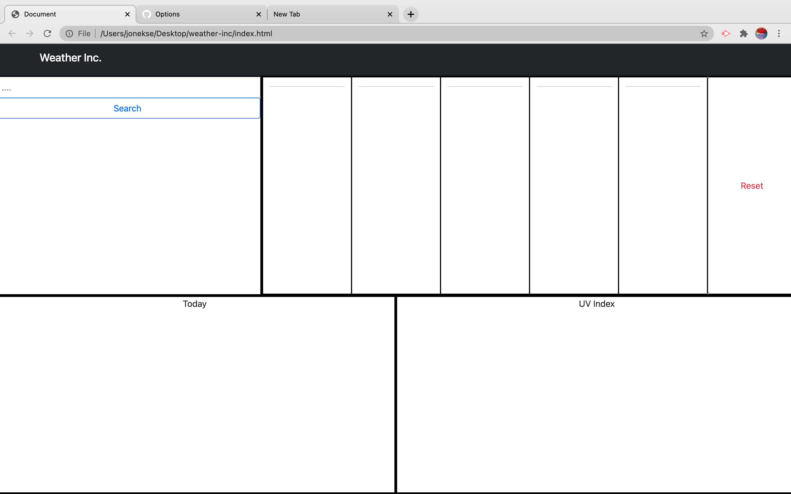
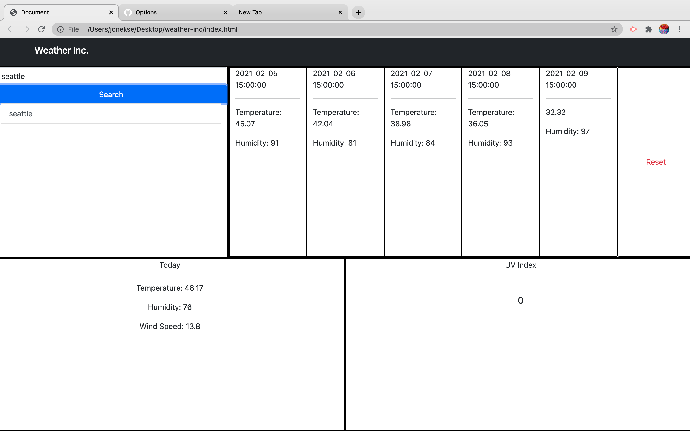
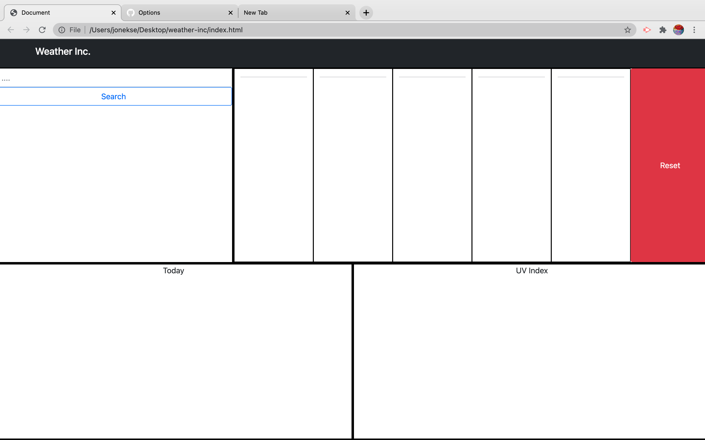

Weather App

For this application I had to use openweather API to collect a user input (a city), then get the current temperature, humidity, wind speed, and UV index and display this information on the page. Another requirement for this project was to display the five day forcast for the requested city and display these seperatly.

this image is of the page with no input, everything is blank but the layout is clear

this next image shows the user has searched for seattle, all of the required information is shown in it's proper place and the information is labled for clarity

finally the image above shows the functionality of the reset button

----------------------------------------------------------------------------The Meat and Potatoes-------------------------------------------------------------------

 the two JQuery functions below show how the buttons work, the first one initiates the search city function (shown next), and (tries) to make a local storage array, as well as assigning the searchvalue to a variable to be passed to the searchCity function. The reset button is as simple as it gets, just a page refresh

 $("#searchButton").on("click", function(){

        //get the value from search box
        var cityInput = $("#search-btn").val();

        localStorage.setItem([], cityInput)

        //calls the search city function with the city input parameter
        searchCity(cityInput);

        
    })
    $("#fiveDayReset").on("click", function(){
        location.reload();
    });

The function below is FROM the searchCity function, but not the enitre thing. This ajax function takes the city input and apiKey, which is globally defined, then filters through the api data using query string selectors and assigning the values to html id's. i am also using day.js to get the dates

$.ajax({
                    type: "GET",
                    url: "https://api.openweathermap.org/data/2.5/forecast?q=" + cityInput + "&units=Imperial&appid=" + apiKey,
                    dataType: "json",
                    success: function(data){
                        console.log(data);
                        $("#dOneHead").append(data.list[2].dt_txt)
                        $("#dOneT").append("Temperature: " + data.list[2].main.temp)
                        $("#dOneH").append("Humidity: " + data.list[2].main.humidity)

                        $("#dTwoHead").append(data.list[10].dt_txt)
                        $("#dTwoT").append("Temperature: " + data.list[10].main.temp)
                        $("#dTwoH").append("Humidity: " + data.list[10].main.humidity)

                        $("#dThreeHead").append(data.list[18].dt_txt)
                        $("#dThreeT").append("Temperature: " + data.list[18].main.temp)
                        $("#dThreeH").append("Humidity: " + data.list[18].main.humidity)

                        $("#dFourHead").append(data.list[26].dt_txt)
                        $("#dFourT").append("Temperature: " + data.list[26].main.temp)
                        $("#dFourH").append("Humidity: " + data.list[26].main.humidity)

                        $("#dFiveHead").append(data.list[34].dt_txt)
                        $("#dFiveT").append(data.list[34].main.temp)
                        $("#dFiveH").append("Humidity: " + data.list[34].main.humidity)
                    }
                })

The code below shows the format I used to make the five day forcast of the city searched. There is no data in the HTML

            

                

                    <header id="dOneHead"></header>
                    

                    

                    

                

                

                    <header id="dTwoHead"></header>
                    

                    

                    

                
